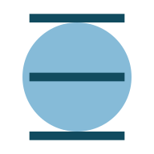

#  immutable2d

[](https://travis-ci.org/ggzorgg/immutable2d)
[](https://codecov.io/gh/ggzorgg/immutable2d)
[](https://npmcharts.com/compare/immutable2d?minimal=true)
[](https://www.jsdelivr.com/package/npm/immutable2d)
[](https://www.npmjs.com/package/immutable2d)
[](https://david-dm.org/ggzorgg/immutable2d)
[](https://github.com/ggzorgg/immutable2d/blob/master/LICENSE)

Immutable 2D geometry library for Javascript/Typescript.

## Features

- 2D geometry primitives and functions:
  - [X] Vector
  - [ ] Point
  - [ ] Box
  - [ ] Circle
  - [ ] Polygon
- Type definitions.
- Composable functions.
- High performance.
- 100% Test coverage.

## Installation

### npm

```bash
npm install immutable2d
```

CommonJS:

```javascript
const { add, negate, Vector } = require('immutable2d/vector')
```

Typescript:

```typescript
import { add, negate, Vector } from 'immutable2d/vector'
```

ES6 (module):

```javascript
import { add, negate, Vector } from 'immutable2d/lib-esm/vector'
```

### CDN

For CDN, you can use [unpkg](https://unpkg.com/):

https://unpkg.com/immutable2d/dist/immutable2d.min.js

Or [jsdelivr](https://www.jsdelivr.com/):

https://cdn.jsdelivr.net/npm/immutable2d/dist/immutable2d.min.js

```javascript
const { add, negate, Vector } = immutable2d.vector
```

## Usage

>**Note: This is work in progress.**

### Vectors

#### Creation

```typescript
import { toVector, Vector } from 'immutable2d/vector'

const x = 10
const y = 10

const v1 = new Vector(x, y)
const v2 = new Vector([x, y]) // Tuples
const v3 = new Vector({ x: 10, y: 10 }) // Objects
const v4 = new Vector({ x, y }) // Objects (ES6)

// With functions
const v5 = toVector(x, y)
const v6 = toVector([x, y])
const v7 = toVector({ x, y })
```

Vectors can also be created with the next functions:

- [fromPolarToVector](./docs/Vector.md#from-polar-in-degrees-and-radians)
- [fromPolarRadiansToVector](./docs/Vector.md#from-polar-in-degrees-and-radians)

#### Operations

- All operations are **static** for ease of composability.
- All operations work with [`VectorLike`](./docs/Vector.md#VectorLike) objects. These objects are either a tuple (an array with at least two elements, in Javascript) or an object with `x` and `y` properties.
- **Many operations have corresponding X and Y functions**, that only operate over the specified component. e.g. `negateX` only negates the X component.

```typescript
import { add, addX, Vector } from 'immutable2d/vector'

const v1 = new Vector(10, 10)

const v3 = add({ x: 20, y: 20 }, v1) // Vector { x: 30, y: 30 }
const v4 = addX(v1, [30, 30]) // Vector { x: 40, y: 10 }
```

- Unary operators:
  - [flip](./docs/Vector.md#flip): Flips the components of the vector.
  - [length](./docs/Vector.md#length): Gets the length of the vector.
  - [lengthSquared](./docs/Vector.md#lengthSquared): Gets the squared length of a Vector.
  - [negate](./docs/Vector.md#negate): Negates both components.
  - [normalize](./docs/Vector.md#normalize): Normalizes a vector.
  - [rotate](./docs/Vector.md#rotate): Rotates the vector by a rotation angle given in degrees.
  - [rotateRadians](./docs/Vector.md#rotateRadians): Same as rotate, but in radians.
- Binary operators:
  - Basic:
    - [add](./docs/Vector.md#add): Adds two vectors component-wise.
    - [substract](./docs/Vector.md#substract): Substracts a vector from another component-wise.
    - [multiply](./docs/Vector.md#multiply): Multiplies each component by a number.
    - [divide](./docs/Vector.md#divide): Divides each component by a number.
    - [dotProduct](./docs/Vector.md#): Returns the dot product of two vectors.
  - Functional (curried by default):
    - [fold](./docs/Vector.md#fold): Applies a binary function with both components of a vector.
    - [map](./docs/Vector.md#map): Applies a function to each component of a vector.
    - [zipWith](./docs/Vector.md#zipWith): Returns a Vector whose components are the result of applying a binary function component-wise.

The `fold`, `map` and `zipWith` functions let you define custom operators easily. In fact, many operations can be defined in terms of these three:

```typescript
import { fold, map, toVector, zipWith } from 'immutable2d/vector'

const flip2 = fold((x, y) => toVector(y, x))
const negate2 = map(a => -a)
const add2 = zipWith((a, b) => a + b)
```

Note that the actual implementations are a little different; this is to allow to define all the `map` and `zipWith` based operations in one line.

[See map based functions source](./src/vector/mapBasedFunctions.ts)\
[See zipWith based functions source](./src/vector/zipWithBasedFunctions.ts)